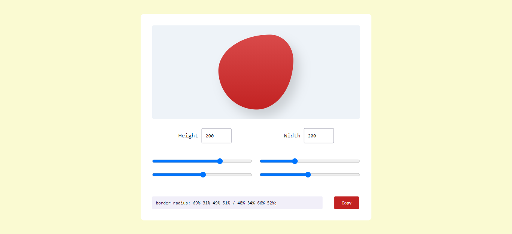

# Blobmaker
Blobmaker is a generative design tool made to help you quickly create random, unique, and organic-looking shapes. It also allows you to copy and paste the information in your project and in this way you can create blob in an easier way. Feel free to use it on your projects: https://theblobmaker.netlify.app/

## Display

